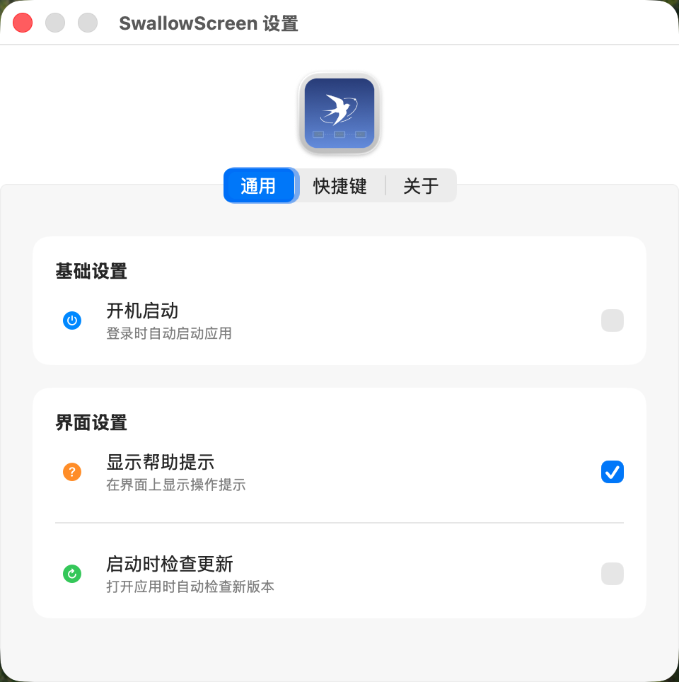

# SwallowScreen

一款 macOS 菜单栏应用，帮助你管理应用窗口在不同屏幕间的显示位置。

[](https://www.apple.com/macos/)
[](https://swift.org/)
[](LICENSE)
[](https://github.com/Qithking/SwallowScreen/releases)

## 功能特性

- 🎯 **固定屏幕**：指定应用只能在特定屏幕移动，拖拽到其他屏幕时自动恢复
- 🖥️ **多屏幕支持**：为每个应用指定首选显示屏幕
- ⌨️ **全局快捷键**：快速设置前台应用的屏幕固定
- ✨ **毛玻璃 UI**：现代化 macOS 设计风格
- 🚀 **开机自启**：支持登录时自动启动
- 🔄 **自动更新**：启动时自动检查并提示更新

## 界面预览

<div style="display: flex; gap: 20px;">
  
  
</div>

### 默认快捷键

| 快捷键 | 功能 |
|--------|------|
| `⌘ + ⇧ + =` | 将前台应用固定到当前屏幕 |
| `⌘ +  + 9` | 取消前台应用的屏幕固定 |

> 💡 **提示**：快捷键可在设置中自定义

## 📦 安装使用

### 下载安装

1. 前往 [Releases](https://github.com/Qithking/SwallowScreen/releases) 页面下载最新版本
2. 解压后运行 `SwallowScreen.app`

### 编译运行

```bash
# 克隆项目
git clone https://github.com/Qithking/SwallowScreen.git
cd SwallowScreen

# 使用 Xcode 打开项目
open SwallowScreen.xcodeproj

# 或使用命令行编译
xcodebuild -project SwallowScreen.xcodeproj -scheme SwallowScreen -configuration Release build
```

编译完成后，运行 `SwallowScreen.app`。

### 快速开始

1. 运行应用后，点击菜单栏的 📌 图标
2. 在应用列表中找到需要配置的应用
3. 点击 📌 图标启用屏幕固定
4. 从下拉菜单中选择目标屏幕
5. 应用将只能在指定屏幕上移动

### 固定屏幕功能

启用固定屏幕后，当尝试将应用窗口拖拽到其他屏幕时，窗口会自动返回到设定的屏幕中心。

### 辅助功能权限

窗口移动功能需要辅助功能权限：

1. 打开「系统设置」→「隐私与安全性」→「辅助功能」
2. 找到 SwallowScreen 并开启权限

> 💡 **提示**：授予权限后，应用会自动检测并启用窗口管理功能，无需重启。

## 📁 项目结构

```
SwallowScreen/
├── SwallowScreenApp.swift      # 应用入口
├── AppDelegate.swift            # 托盘、菜单、快捷键处理
├── AppPopoverView.swift         # 托盘弹出主界面
├── SettingsView.swift           # 设置窗口视图
├── DownloadWindow.swift         # 下载进度窗口
├── AppManager.swift             # 系统应用列表管理
├── ScreenManager.swift          # 屏幕/显示器管理
├── WindowMover.swift            # 窗口移动服务
├── VisualEffectView.swift       # 毛玻璃背景组件
├── AppInfo.swift                # 应用配置数据模型
├── AppSettings.swift            # 全局设置数据模型
└── Assets.xcassets/             # 资源文件
```

## 🛠️ 技术栈

- **UI 框架**：SwiftUI + AppKit
- **数据持久化**：SwiftData
- **系统 API**：Accessibility API, Carbon HotKeys
- **最低支持**：macOS 13.0+

## 💻 系统要求

- macOS 13.0 (Ventura) 或更高版本
- 支持多显示器环境

## 🤝 贡献

欢迎提交 Issue 和 Pull Request！

1. Fork 本仓库
2. 创建特性分支 (`git checkout -b feature/AmazingFeature`)
3. 提交更改 (`git commit -m 'Add some AmazingFeature'`)
4. 推送到分支 (`git push origin feature/AmazingFeature`)
5. 开启 Pull Request

## 📝 反馈与支持

- 🐛 [报告 Bug](https://github.com/Qithking/SwallowScreen/issues)
- 💡 [提出建议](https://github.com/Qithking/SwallowScreen/issues)
- ⭐ 如果觉得项目有用，欢迎 Star 支持

## 📄 License

本项目采用 [GPL-3.0 License](LICENSE) 开源协议。

## ☕ 赞助支持

如果这个项目对你有帮助，欢迎请我喝杯咖啡！

<div style="display: flex; gap: 20px; justify-content: center;">
  
  
</div>
