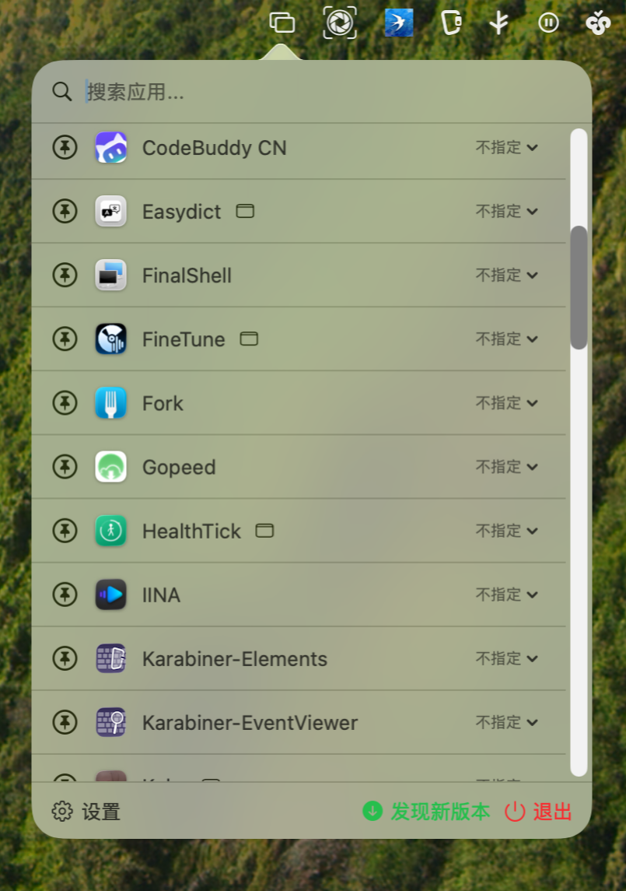

# SwallowScreen

一款 macOS Menu Bar 应用，帮助你管理应用窗口在不同屏幕上的显示位置。

[](https://www.apple.com/macos/)
[](https://swift.org/)
[](LICENSE)

## 功能特性

- **固定屏幕**：指定应用只能在特定屏幕移动，拖拽到其他屏幕时自动恢复
- **多屏幕支持**：为每个应用指定首选显示屏幕
- **全局快捷键**：快速设置前台应用的屏幕
- **毛玻璃 UI**：现代化 macOS 设计风格
- **开机启动**：支持开机自动启动
- **自动更新检查**：启动时自动检查并提示更新

## 界面说明

<div style="display: flex; gap: 20px;">
  
  
</div>

### 快捷键

| 快捷键 | 功能 |
|--------|------|
| ⌘ + ⇧ + 1 | 将前台应用设置到当前所在屏幕 |
| ⌘ + ⇧ + 2 | 取消前台应用的屏幕设置 |

## 使用方法

### 编译运行

```bash
# 使用 Xcode 打开项目
open SwallowScreen.xcodeproj

# 或使用命令行编译
xcodebuild -project SwallowScreen.xcodeproj -scheme SwallowScreen -configuration Release build
```

编译完成后，运行 `SwallowScreen.app`。

### 首次使用

1. 运行应用后，点击菜单栏的 📌 图标
2. 在应用列表中找到需要配置的应用
3. 点击 📌 图标启用固定屏幕
4. 从下拉菜单中选择目标屏幕
5. 应用将只能在指定屏幕上移动

### 固定屏幕功能

1. 启用固定屏幕并选择目标屏幕
2. 拖拽应用窗口到其他屏幕
3. 窗口会自动移回目标屏幕中心

### 辅助功能权限

窗口移动功能需要辅助功能权限：

1. 打开「系统设置」→「隐私与安全性」→「辅助功能」
2. 找到 SwallowScreen 并开启权限

> **提示**：授予权限后，应用会自动检测并启用窗口管理功能，无需重启。

## 项目结构

```
SwallowScreen/
├── SwallowScreenApp.swift      # 应用入口
├── AppDelegate.swift            # 托盘、菜单、快捷键处理
├── AppPopoverView.swift         # 托盘弹出主界面
├── SettingsView.swift           # 设置窗口视图
├── AppManager.swift             # 系统应用列表管理
├── ScreenManager.swift          # 屏幕/显示器管理
├── WindowMover.swift            # 窗口移动服务
├── VisualEffectView.swift       # 毛玻璃背景组件
├── AppInfo.swift                # 应用配置数据模型
├── AppSettings.swift            # 全局设置数据模型
└── Assets.xcassets/             # 资源文件
```

## 技术栈

- SwiftUI
- SwiftData
- AppKit (NSStatusItem, NSPopover, NSWindow)
- Accessibility API
- Carbon HotKeys

## 开发工具
- CodeBuddy:ai 工具生成代码
- Xcode:基于生成代码进行可视化调试编译

## 系统要求

- macOS 13.0+
- 多显示器支持

## License

GPLv3 License
