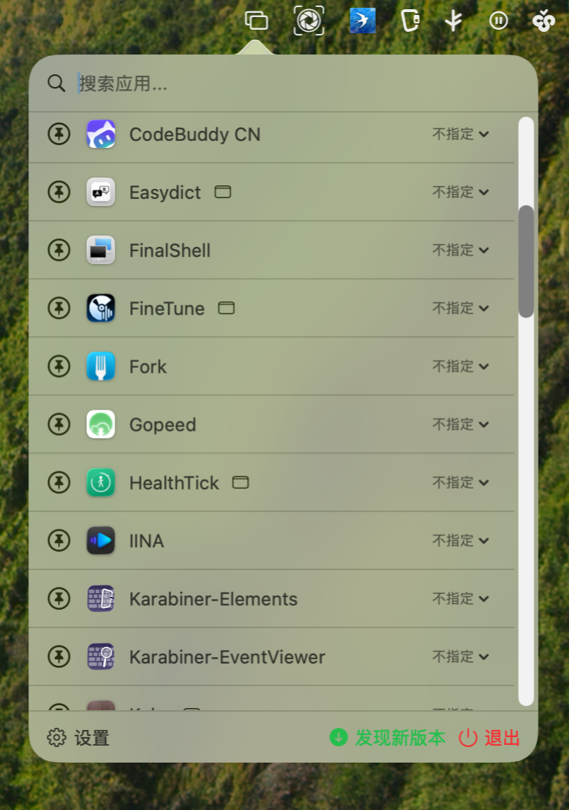
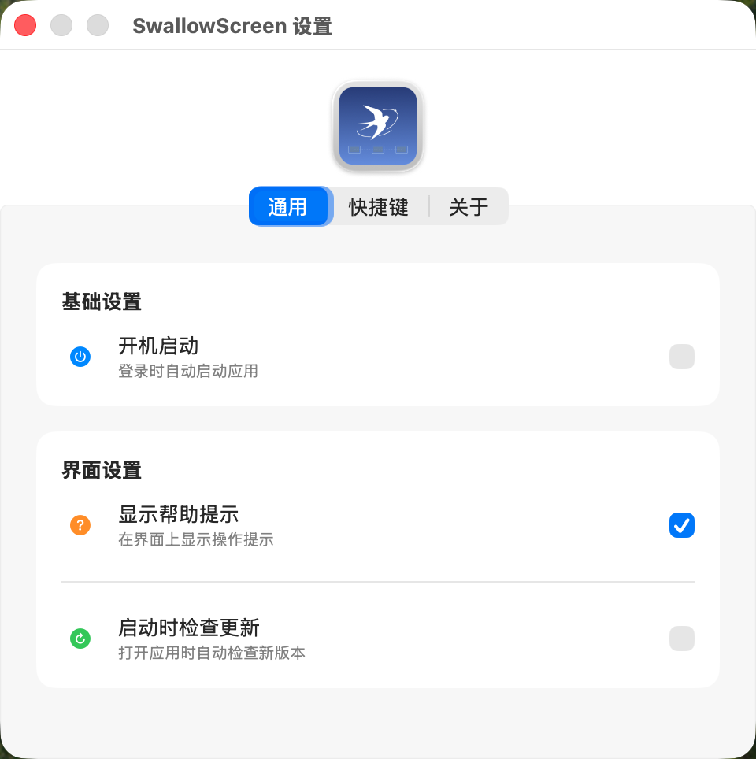

<!-- Banner -->

<p align="center">
  
</p>

<h1 align="center">SwallowScreen</h1>

<p align="center">
  一款 macOS 菜单栏应用，帮助你将应用窗口固定在指定屏幕，<br/>
  拖拽到其他屏幕时自动回弹，让多显示器工作流更可控。
</p>

<p align="center">
  <a href="https://github.com/Qithking/SwallowScreen/releases"></a>
  <a href="https://github.com/Qithking/SwallowScreen/releases"></a>
  <a href="https://github.com/Qithking/SwallowScreen/stargazers"></a>
  <a href="https://github.com/Qithking/SwallowScreen/network/members"></a>
  <a href="https://github.com/Qithking/SwallowScreen/issues"></a>
</p>

<p align="center">
  <a href="https://www.apple.com/macos/"></a>
  <a href="https://swift.org/"></a>
  <a href="LICENSE"></a>
  <a href="https://github.com/Qithking/SwallowScreen/actions"></a>
</p>

<p align="center">
  <a href="README.md">简体中文</a> · <a href="#license">License</a> · <a href="https://github.com/Qithking/SwallowScreen/issues">反馈问题</a>
</p>

***

## 📑 目录

- [✨ 功能特性](#-功能特性)
- [🖼️ 界面预览](#️-界面预览)
- [🚀 快速开始](#-快速开始)
- [⌨️ 默认快捷键](#️-默认快捷键)
- [⚙️ 辅助功能权限](#️-辅助功能权限)
- [📦 编译运行](#-编译运行)
- [🧩 项目结构](#-项目结构)
- [🛠️ 技术栈](#️-技术栈)
- [❓ 常见问题 (FAQ)](#-常见问题-faq)
- [🤝 贡献指南](#-贡献指南)
- [⭐ Star History](#-star-history)
- [📄 License](#-license)

***

## ✨ 功能特性

|  图标 | 特性         | 说明                                 |
| :-: | ---------- | ---------------------------------- |
|  🎯 | **固定屏幕**   | 指定应用只能在特定屏幕移动，拖拽到其他屏幕时自动回弹         |
| 🖥️ | **多屏幕支持**  | 为每个应用指定首选显示屏幕，跨屏操作可控               |
|  ⌨️ | **全局快捷键**  | 一键固定 / 解除前台应用的屏幕归属                 |
|  ✨  | **毛玻璃 UI** | 采用 SwiftUI + AppKit 现代化 macOS 设计语言 |
|  🚀 | **开机自启**   | 支持登录时自动启动，常驻菜单栏                    |
|  🔄 | **自动更新**   | 启动时自动检查并提示新版本                      |
|  💾 | **本地持久化**  | 配置基于 SwiftData 本地存储，隐私友好           |

## 🖼️ 界面预览

<p align="center">
  
  &nbsp;&nbsp;
  
</p>

<p align="center">
  <em>左：托盘主菜单 &nbsp;&nbsp;|&nbsp;&nbsp; 右：应用与屏幕设置</em>
</p>

## 🚀 快速开始

1. 前往 [Releases](https://github.com/Qithking/SwallowScreen/releases) 下载最新的 `SwallowScreen-*-universal.dmg`。
2. 打开 DMG，将 `SwallowScreen.app` 拖入 **应用程序** 文件夹。
3. 启动应用，授予「辅助功能」权限（首次启动会自动引导）。
4. 点击菜单栏的 📌 图标，在应用列表中为需要控制的应用启用屏幕固定。
5. 选择目标屏幕，从此该应用窗口只能在指定屏幕中活动。

> 💡 首次运行如果提示「无法打开」，请在 **系统设置 → 隐私与安全性** 中点击「仍要打开」。

## ⌨️ 默认快捷键

| 快捷键         | 功能           |
| ----------- | ------------ |
| `⌘ + ⇧ + =` | 将前台应用固定到当前屏幕 |
| `⌘ + ⇧ + 9` | 取消前台应用的屏幕固定  |

> 💡 快捷键可在「设置」中自定义，支持 `⌘ / ⌥ / ⇧ / ⌃` 的任意组合。

## ⚙️ 辅助功能权限

窗口移动监控依赖 macOS 的 Accessibility API：

1. 打开 **系统设置 → 隐私与安全性 → 辅助功能**。
2. 找到 `SwallowScreen` 并开启权限。
3. 应用会自动检测权限状态并启用窗口管理功能，无需重启。

> 🔐 所有窗口检测逻辑均在本地完成，不会上传任何窗口或应用信息。

## 📦 编译运行

### 方式一：Xcode

```bash
git clone https://github.com/Qithking/SwallowScreen.git
cd SwallowScreen
open SwallowScreen.xcodeproj
```

在 Xcode 中选择 `SwallowScreen` Scheme，按 `⌘R` 运行。

### 方式二：Swift Package Manager

```bash
git clone https://github.com/Qithking/SwallowScreen.git
cd SwallowScreen

# 编译（生成可执行文件在 .build/release/SwallowScreen）
swift build -c release

# 运行
./.build/release/SwallowScreen
```

### 方式三：命令行通用二进制

```bash
xcodebuild -project SwallowScreen.xcodeproj \
           -scheme SwallowScreen \
           -configuration Release \
           -derivedDataPath build \
           build
```

构建产物位于 `build/Build/Products/Release/SwallowScreen.app`。

## 🧩 项目结构

```text
SwallowScreen/
├── SwallowScreenApp.swift      # @main 应用入口
├── AppDelegate.swift            # 托盘、菜单、全局快捷键
├── AppPopoverView.swift         # 托盘弹出主界面
├── SettingsView.swift           # 设置窗口视图
├── DownloadWindow.swift         # 版本更新下载进度窗口
├── UpdateChecker.swift          # 自动更新检测服务
├── AppManager.swift             # 系统应用列表与运行状态
├── ScreenManager.swift          # 显示器接入与变更监听
├── WindowMover.swift            # 窗口移动与回弹核心逻辑
├── VisualEffectView.swift       # 毛玻璃背景组件
├── AppInfo.swift                # 应用配置数据模型
├── AppSettings.swift            # 全局设置数据模型
├── Info.plist                   # 应用清单
└── Assets.xcassets/             # 图标与颜色资源
```

## 🛠️ 技术栈

- **UI 框架**：SwiftUI + AppKit
- **数据持久化**：SwiftData
- **系统 API**：Accessibility API、Carbon HotKey
- **最低支持**：macOS 14.0 (Sonoma) 及以上
- **构建系统**：Swift Package Manager / Xcode

## ❓ 常见问题 (FAQ)

<details>
<summary><b>Q1：应用无法启动，提示「已损坏」或「无法验证开发者」？</b></summary>

项目使用 Ad-hoc 签名分发。首次打开时，请在 **系统设置 → 隐私与安全性** 页面底部点击「仍要打开」即可。

</details>

<details>
<summary><b>Q2：固定屏幕后窗口仍会跑到其他屏幕？</b></summary>

请确认已为 SwallowScreen 授予「辅助功能」权限；同时请确保目标应用没有以「管理员身份运行」，否则 Accessibility API 无法管控其窗口。

</details>

<details>
<summary><b>Q3：能否控制全屏（原生全屏 / Split View）应用？</b></summary>

macOS 对全屏窗口的跨屏控制存在系统级限制，SwallowScreen 仅能对普通窗口生效。建议对需要固定的应用使用「最大化」而非「全屏」。

</details>

<details>
<summary><b>Q4：是否会上传我的窗口或应用信息？</b></summary>

不会。所有窗口检测与控制逻辑完全在本地运行，应用也不接入任何遥测服务。

</details>

<details>
<summary><b>Q5：如何完全卸载？</b></summary>

将 `SwallowScreen.app` 移入废纸篓，并删除 `~/Library/Application Support/SwallowScreen` 下的数据目录即可。

</details>

## 🤝 贡献指南

欢迎任何形式的贡献：Bug 报告、功能建议、文档改进或代码 PR。

1. Fork 本仓库
2. 创建特性分支：`git checkout -b feature/AmazingFeature`
3. 提交更改：`git commit -m 'feat: add amazing feature'`
4. 推送到分支：`git push origin feature/AmazingFeature`
5. 发起 Pull Request，并在描述中关联对应 Issue

> 提交前请阅读 [CONTRIBUTING.md](.github/CONTRIBUTING.md)（如有），并确保 `swift build -c release` 能够成功。

### 行为准则

请遵守 [Contributor Covenant Code of Conduct](https://www.contributor-covenant.org/version/2/1/code_of_conduct/)。

## ⭐ Star History

<p align="center">
  <a href="https://star-history.com/#Qithking/SwallowScreen&Date">
    
  </a>
</p>

## 📄 License

本项目基于 [GPL-3.0 License](LICENSE) 开源。
Copyright © 2024 Qithking & SwallowScreen Contributors.

***

<p align="center">
  如果这个项目对你有帮助，欢迎 ⭐ <b>Star</b> 支持，让更多人发现它 🙌
</p>
